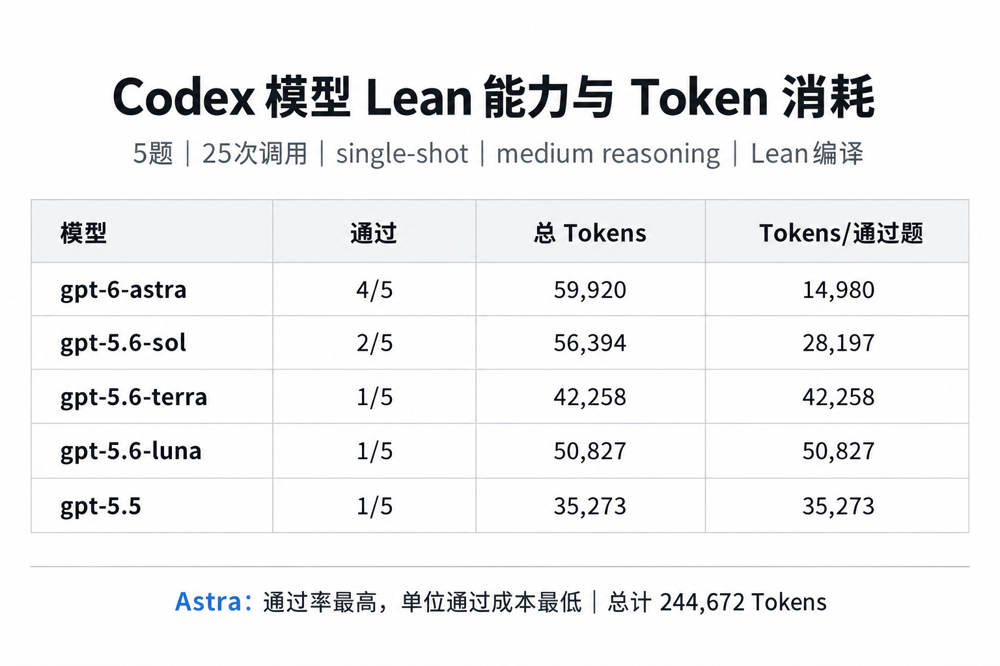

# AutoLean integrated benchmark

> Includes a 30-problem Lean benchmark runner and a reproducible 5-problem comparison of currently callable Codex models.

## Latest Codex model comparison

The `results/` directory contains the single-shot, medium-reasoning evaluation artifacts for five Codex models. Each candidate proof was checked by the corresponding Lean workspace compiler.



- [Detailed report](results/codex-lean-5problem-report.md)
- [Summary CSV](results/codex-lean-5problem-results.csv)
- [Generated proofs and timing](results/codex-lean-generation.jsonl)
- [Combined Lean verification files](results/codex-lean-combined/)

This project connects a 30-problem development set (10 miniF2F, 10 ProofNet-Verified, 10 PutnamBench) to a compiler-guided Lean repair loop.

## Windows PowerShell quick start

```powershell
.\.venv\Scripts\Activate.ps1
pip install -e .
python -m unittest discover -s tests -v
autolean info
autolean check --problem-id proofnet_1_Artin_exercise_2_2_9
```

`autolean check` compiles the original statement with its single `sorry`; this confirms that imports, versions, and the selected Lake workspace are valid. `autolean run` replaces the hole with a generated proof and rejects `sorry`, `admit`, `axiom`, and `native_decide`.

For OpenAI-backed runs, set `OPENAI_API_KEY` and optionally `OPENAI_MODEL` and `OPENAI_BASE_URL`, then run:

```powershell
autolean run --problem-id proofnet_1_Artin_exercise_2_2_9 --provider openai --max-repairs 5
autolean batch --provider openai --max-repairs 5 --results runs/dev_repair.jsonl --resume
python scripts/summarize_results.py runs/dev_repair.jsonl
```

The benchmark is reproducibly regenerated from the repositories in `external/` with `python scripts/build_benchmark.py`.
